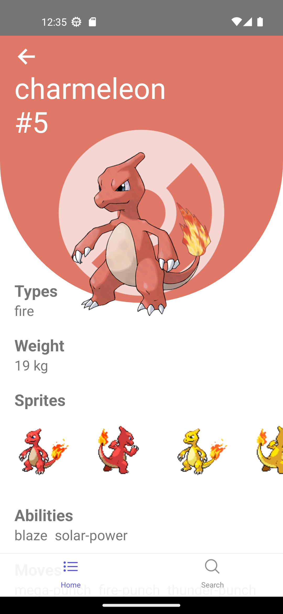

# Pokémon app
Pokémon info app built with React Native. 

## Features
 * Show Pokémon list
 * Search Pokémon by name or id
 * Show information about each Pokémon, such as:

    - Types
    - Weight
    - Moves
 
## Installation
1. Clone the repository
```bash
git clone https://github.com/Fernando-LRz/pokemon-app.git
``` 
2. Navigate to the project directory
```bash
cd pokemon-app
```
3. Install dependencies
```bash
npm install
```

## Run the app
```bash
npx react-native run-android
```

## App images
| Home                                                  | Pokémon                                                  | Pokémon search                                           |
| ----------------------------------------------------- | -------------------------------------------------------- | -------------------------------------------------------- |
|  |  |   |
